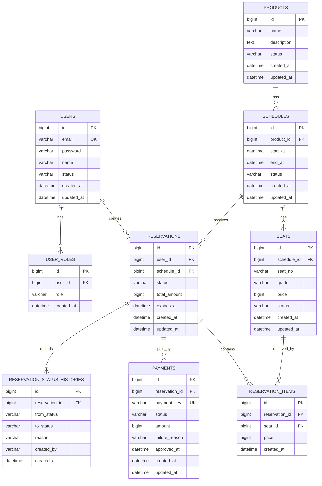

# SeatHub ERD 초안

## 설계 기준

1차 구현에서는 예약·결제 흐름을 검증하는 데 필요한 테이블만 필수로 둡니다. 정산, 이벤트 발행, 운영 로그는 2차 개선 범위로 분리합니다.

---

## Mermaid ERD

---

## 필수 테이블

| 테이블 | 역할 |
| --- | --- |
| `users` | 회원 정보 |
| `user_roles` | 사용자 권한 |
| `products` | 예약 상품 |
| `schedules` | 상품별 예약 회차 |
| `seats` | 회차별 좌석 |
| `reservations` | 예약 마스터 |
| `reservation_items` | 예약 좌석 상세 |
| `payments` | 결제 정보 |
| `reservation_status_histories` | 예약 상태 변경 이력 |

---

## 주요 제약 조건

| 대상 | 제약 조건 |
| --- | --- |
| `users.email` | 중복 가입 방지를 위해 Unique 적용 |
| `seats.schedule_id + seats.seat_no` | 같은 회차에서 좌석 번호 중복 방지 |
| `reservation_items.seat_id` | 하나의 좌석이 여러 확정 예약에 중복 연결되지 않도록 예약 로직에서 제어 |
| `payments.payment_key` | 결제 승인 중복 요청 방지를 위해 Unique 적용 |

---

## 인덱스 후보

| 테이블 | 인덱스 후보 | 목적 |
| --- | --- | --- |
| `reservations` | `(status, created_at)` | 관리자 예약 상태/기간 검색 |
| `reservations` | `(user_id, created_at)` | 내 예약 목록 조회 |
| `payments` | `(status, created_at)` | 관리자 결제 상태/기간 검색 |
| `schedules` | `(product_id, start_at)` | 상품별 회차 조회 |
| `seats` | `(schedule_id, status)` | 회차별 예약 가능 좌석 조회 |

---

## 2차 개선 테이블

| 테이블 | 역할 |
| --- | --- |
| `settlements` | 일별 정산 마스터 |
| `settlement_items` | 정산 상세 |
| `operation_logs` | 관리자 작업 로그 |
| `outbox_events` | 이벤트 발행 보장 |

