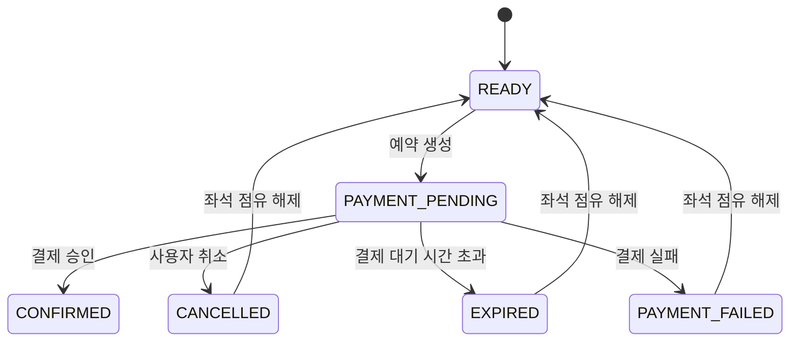

# 예약 상태 흐름

## 상태 목록

| 상태 | 설명 |
| --- | --- |
| `READY` | 좌석이 예약 가능한 상태 |
| `PAYMENT_PENDING` | 예약이 생성되었고 결제 대기 중인 상태 |
| `CONFIRMED` | 결제가 승인되어 예약이 확정된 상태 |
| `CANCELLED` | 사용자가 예약을 취소한 상태 |
| `EXPIRED` | 결제 대기 시간이 지나 자동 만료된 상태 |
| `PAYMENT_FAILED` | 결제 실패로 예약이 확정되지 않은 상태 |

---

## 상태 전이

---

## 상태 변경 이력

예약 상태가 변경될 때마다 `reservation_status_histories`에 이력을 저장합니다.

저장할 정보:

- 예약 ID
- 변경 전 상태
- 변경 후 상태
- 변경 사유
- 변경 주체
- 변경 시각

---

## 설계 메모

예약과 결제는 외부 시스템이 개입되므로 하나의 긴 트랜잭션으로 묶지 않습니다. 예약 생성 시에는 좌석을 임시 점유하고 `PAYMENT_PENDING` 상태로 둡니다. 결제 승인 후 `CONFIRMED`로 변경하며, 결제 실패나 대기 시간 초과 시 좌석 점유를 해제합니다.
