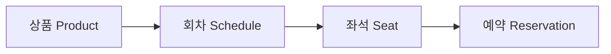

# 상품, 회차, 좌석 설계

## 이 문서의 목적

SeatHub의 예약 기능은 상품, 회차, 좌석이 먼저 준비되어 있어야 만들 수 있습니다.

예약은 사용자가 갑자기 아무 대상이나 예약하는 기능이 아닙니다. 관리자가 예약 가능한 상품과 시간, 좌석을 먼저 열어두고, 사용자는 그중 하나를 선택해 예약합니다.

```text
상품 등록
-> 회차 등록
-> 좌석 등록
-> 사용자가 좌석 조회
-> 예약 생성
```

---

## 1. 상품 Product

상품은 사용자가 예약하려는 대상입니다.

예시는 다음과 같습니다.

```text
공연
클래스
시설 이용권
상담 상품
```

### 책임

- 예약 대상의 기본 정보를 가진다.
- 상품명, 설명, 상태를 관리한다.
- 여러 회차를 가질 수 있다.

### 필드 초안

| 필드 | 설명 |
| --- | --- |
| `id` | 상품 식별자 |
| `name` | 상품명 |
| `description` | 상품 설명 |
| `status` | 판매 또는 노출 상태 |
| `createdAt` | 생성일시 |
| `updatedAt` | 수정일시 |

### 상태 후보

```text
ACTIVE
INACTIVE
```

- `ACTIVE`: 사용자에게 노출 가능한 상품
- `INACTIVE`: 숨김 또는 운영 중지 상품

---

## 2. 회차 Schedule

회차는 특정 상품이 예약 가능한 시간 단위입니다.

예시는 다음과 같습니다.

```text
2026-05-20 14:00 공연
2026-05-20 16:00 클래스
2026-05-21 10:00 상담
```

상품이 “무엇을 예약하는가”라면, 회차는 “언제 예약하는가”를 나타냅니다.

### 책임

- 상품의 예약 가능 시간을 관리한다.
- 시작 시간과 종료 시간을 가진다.
- 회차별 좌석을 가진다.

### 필드 초안

| 필드 | 설명 |
| --- | --- |
| `id` | 회차 식별자 |
| `productId` | 어떤 상품의 회차인지 |
| `startAt` | 시작 일시 |
| `endAt` | 종료 일시 |
| `status` | 회차 상태 |
| `createdAt` | 생성일시 |
| `updatedAt` | 수정일시 |

### 상태 후보

```text
OPEN
CLOSED
CANCELLED
```

- `OPEN`: 예약 가능
- `CLOSED`: 예약 마감
- `CANCELLED`: 회차 취소

---

## 3. 좌석 Seat

좌석은 특정 회차에서 실제로 예약되는 단위입니다.

같은 상품이라도 회차가 다르면 좌석도 다르게 관리해야 합니다.

예를 들어 `A1` 좌석이 있어도 아래 두 좌석은 서로 다른 좌석입니다.

```text
5월 20일 14시 회차의 A1
5월 20일 16시 회차의 A1
```

그래서 좌석은 상품이 아니라 회차에 속합니다.

### 책임

- 회차별 예약 가능 단위를 관리한다.
- 좌석 번호, 등급, 가격, 상태를 가진다.
- 예약 생성 시 중복 예약을 막는 기준이 된다.

### 필드 초안

| 필드 | 설명 |
| --- | --- |
| `id` | 좌석 식별자 |
| `scheduleId` | 어떤 회차의 좌석인지 |
| `seatNo` | 좌석 번호 |
| `grade` | 좌석 등급 |
| `price` | 좌석 가격 |
| `status` | 좌석 상태 |
| `createdAt` | 생성일시 |
| `updatedAt` | 수정일시 |

### 상태 후보

```text
AVAILABLE
HOLD
RESERVED
UNAVAILABLE
```

- `AVAILABLE`: 예약 가능
- `HOLD`: 결제 대기 중 임시 점유
- `RESERVED`: 예약 확정
- `UNAVAILABLE`: 운영자가 막아둔 좌석

---

## 관계 정리



```text
상품 1개는 여러 회차를 가진다.
회차 1개는 여러 좌석을 가진다.
예약은 특정 회차의 특정 좌석을 대상으로 생성된다.
```

---

## 관리자 API와 사용자 API를 나누는 이유

관리자와 사용자는 같은 데이터를 보더라도 목적이 다릅니다.

| 구분 | 목적 | 예시 |
| --- | --- | --- |
| 관리자 | 예약 가능한 구조를 만든다 | 상품 등록, 회차 등록, 좌석 등록 |
| 사용자 | 예약 가능한 정보를 조회한다 | 상품 목록, 회차 목록, 좌석 목록 |

그래서 API도 분리합니다.

```text
관리자 API
POST /api/v1/admin/products
POST /api/v1/admin/products/{productId}/schedules
POST /api/v1/admin/schedules/{scheduleId}/seats

사용자 API
GET /api/v1/products
GET /api/v1/products/{productId}
GET /api/v1/products/{productId}/schedules
GET /api/v1/schedules/{scheduleId}/seats
```

관리자 API는 권한 검사가 필요하고, 사용자 조회 API는 예약 가능한 정보만 안전하게 노출해야 합니다.

---

## 다음 구현 순서

2주차 구현은 아래 순서로 진행합니다.

```text
Product Entity
-> Product 등록/조회 API
-> Schedule Entity
-> Schedule 등록/조회 API
-> Seat Entity
-> Seat 등록/조회 API
-> 통합 테스트
```

이 순서로 진행하면 예약 기능을 만들기 전에 필요한 기준 데이터를 안정적으로 준비할 수 있습니다.

