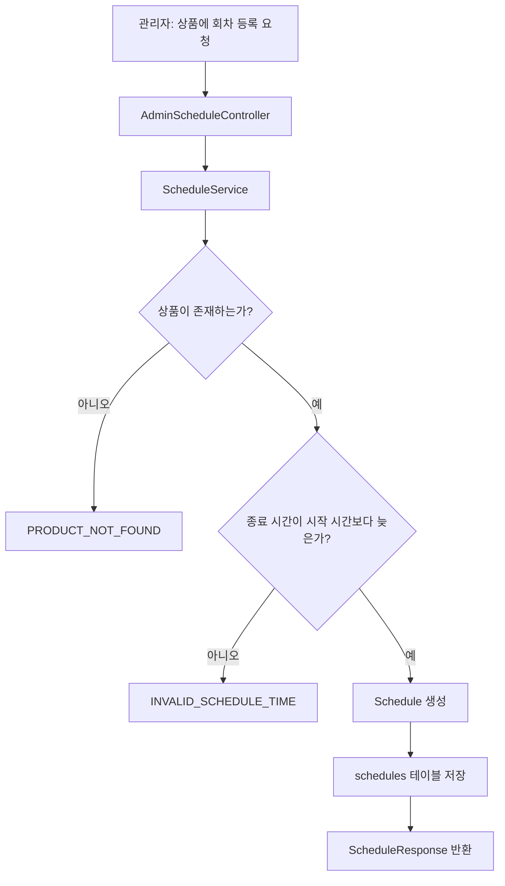

# 11일차 - Schedule 등록/조회 API

## 오늘 한 일

상품에 회차를 등록하고, 사용자가 상품별 회차 목록을 조회할 수 있는 API를 구현했습니다.

SeatHub에서 `Product`는 예약 대상 자체를 의미하고, `Schedule`은 그 상품을 언제 이용할 수 있는지를 의미합니다.
예를 들어 `뮤지컬 A`라는 상품이 있더라도 6월 1일 19시 회차, 6월 2일 19시 회차처럼 여러 시간이 존재할 수 있으므로 상품과 회차를 분리했습니다.

## 구현한 API

| 구분 | Method | URL | 설명 |
| --- | --- | --- | --- |
| 관리자 | POST | `/api/v1/admin/products/{productId}/schedules` | 상품에 회차 등록 |
| 사용자 | GET | `/api/v1/products/{productId}/schedules` | 상품별 회차 목록 조회 |

## 데이터 흐름



## 주요 설계 판단

### Product와 Schedule을 분리한 이유

상품과 회차를 하나의 테이블에 모두 넣으면 같은 상품 설명이 회차 수만큼 반복됩니다.
또 상품 설명이 바뀔 때 여러 행을 수정해야 해서 데이터 정합성 문제가 생길 수 있습니다.

그래서 상품은 `products`, 회차는 `schedules`로 분리했습니다.

```text
products 1개
  └─ schedules 여러 개
```

이 구조를 사용하면 상품 정보는 한 번만 저장하고, 날짜와 시간 정보만 회차로 여러 개 등록할 수 있습니다.

### 회차 시간 검증을 추가한 이유

회차는 시작 시간과 종료 시간이 있습니다.
종료 시간이 시작 시간보다 빠르거나 같으면 실제 예약 가능한 시간이 성립하지 않습니다.

그래서 서비스 계층에서 다음 조건을 검증했습니다.

```text
endAt > startAt
```

이 검증은 단순한 입력 체크처럼 보이지만, 나중에 좌석 생성, 예약 가능 시간 계산, 결제 만료 시간 계산과 연결되기 때문에 초기에 막는 것이 좋습니다.

### 회차 목록을 startAt 오름차순으로 조회한 이유

사용자가 상품 상세 화면에서 회차를 고를 때는 보통 빠른 날짜부터 확인합니다.
그래서 `findByProductIdOrderByStartAtAsc` 메서드를 사용해 시작 시간이 빠른 회차부터 반환하도록 했습니다.

## 추가한 파일

| 파일 | 역할 |
| --- | --- |
| `Schedule.java` | 회차 Entity |
| `ScheduleStatus.java` | 회차 상태 enum |
| `ScheduleRepository.java` | 회차 DB 접근 |
| `CreateScheduleRequest.java` | 회차 등록 요청 DTO |
| `ScheduleResponse.java` | 회차 응답 DTO |
| `ScheduleService.java` | 회차 등록/조회 비즈니스 로직 |
| `AdminScheduleController.java` | 관리자 회차 등록 API |
| `ScheduleController.java` | 사용자 회차 조회 API |
| `V3__create_schedules.sql` | schedules 테이블 생성 마이그레이션 |

## 테스트한 내용

| 테스트 | 확인한 내용 |
| --- | --- |
| `ScheduleServiceTest.createSchedule` | 회차가 정상 저장되는지 |
| `ScheduleServiceTest.getSchedulesReturnsEarliestScheduleFirst` | 빠른 회차가 먼저 조회되는지 |
| `ScheduleServiceTest.createScheduleRejectsUnknownProduct` | 없는 상품에는 회차를 등록할 수 없는지 |
| `ScheduleServiceTest.createScheduleRejectsInvalidTimeRange` | 잘못된 시간 범위를 거부하는지 |
| `AdminScheduleControllerTest.createSchedule` | 관리자 회차 등록 API가 정상 동작하는지 |
| `ScheduleControllerTest.getSchedules` | 사용자 회차 목록 조회 API가 정상 동작하는지 |

## 다음 작업과 연결

다음 단계에서는 `Schedule` 아래에 좌석 또는 재고를 붙입니다.

```text
Product
  └─ Schedule
       └─ Seat
```

좌석이 추가되면 이후 예약 생성 API에서 다음 흐름을 구현할 수 있습니다.

```text
상품 선택 -> 회차 선택 -> 좌석 선택 -> 예약 생성 -> 결제 대기
```
